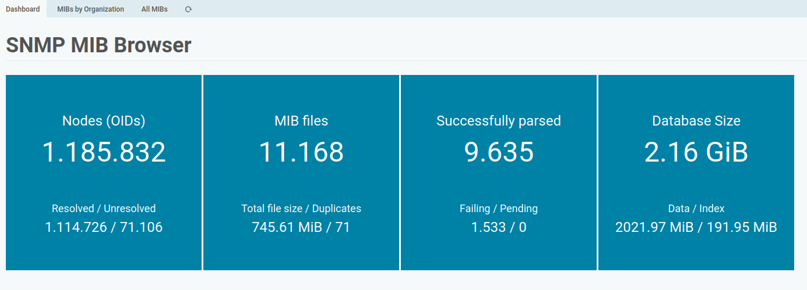
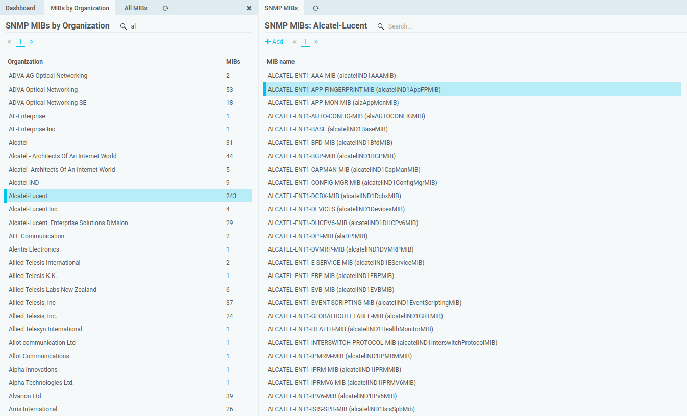
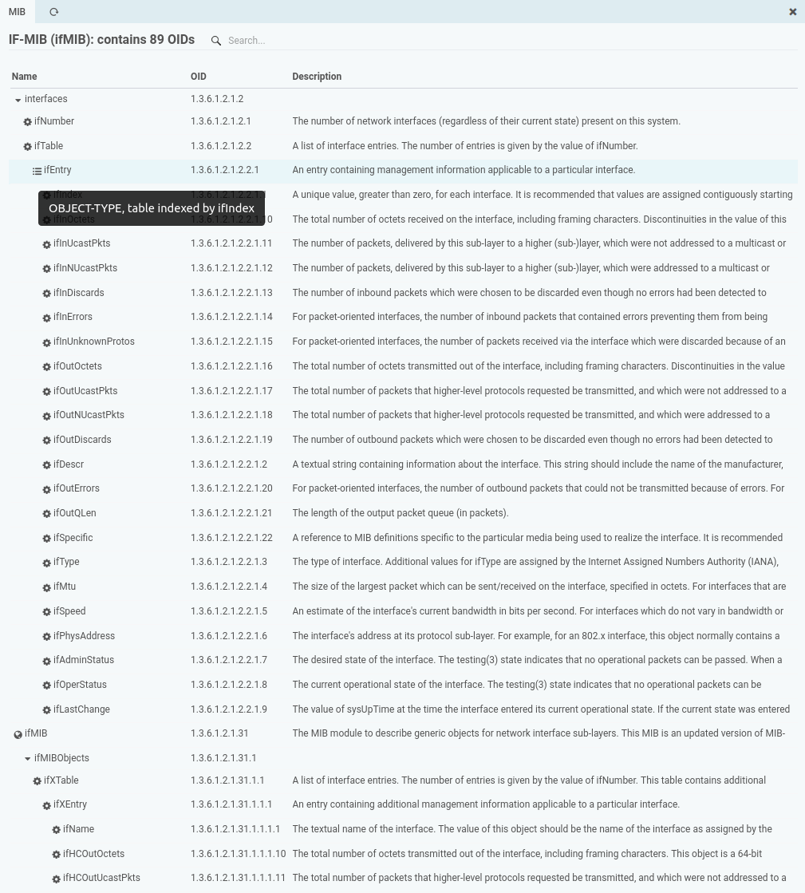
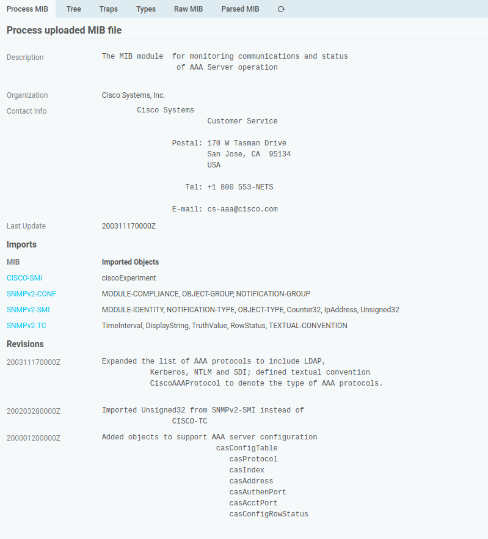
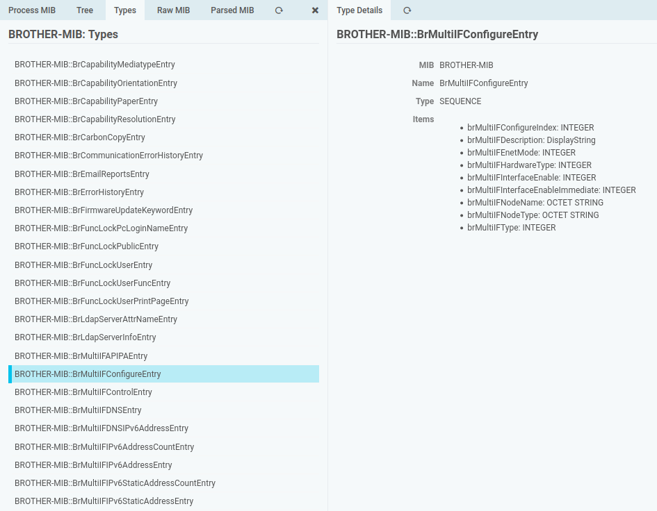
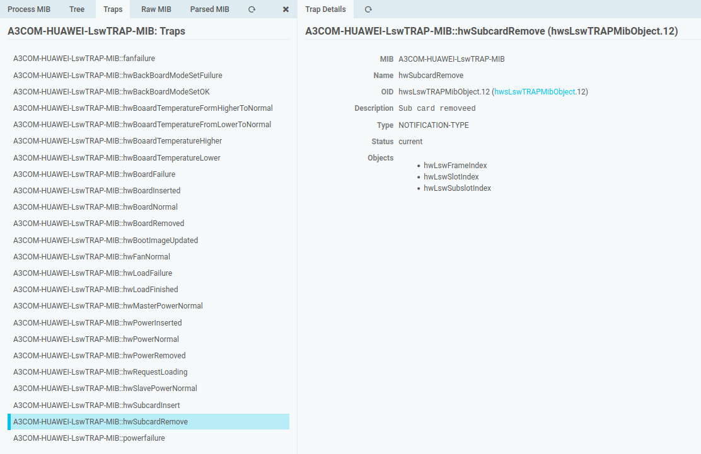
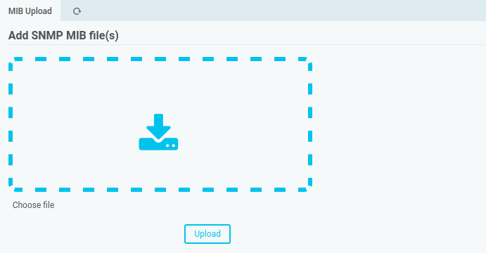
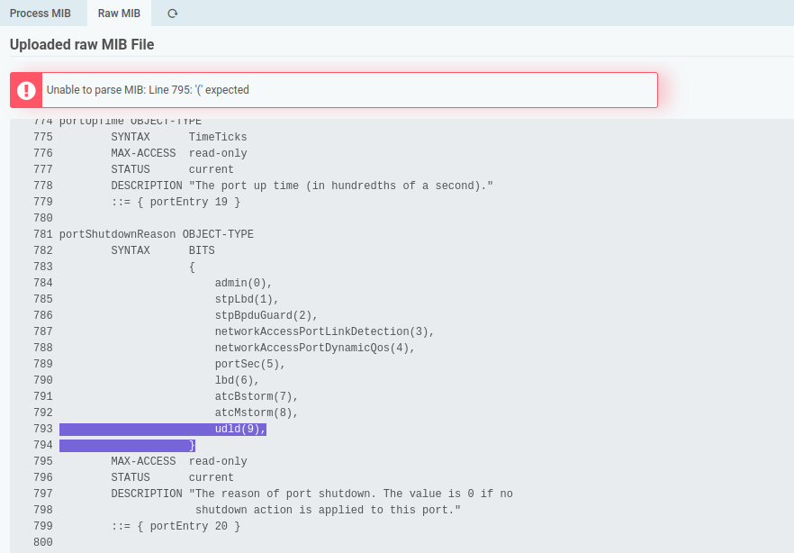

SNMP MIB Browser for Icinga
===========================

**WARNING**: This module is in an early stage and should not be used at all.

Features
--------

### Overview Dashboard

The dashboard shows some shiny numbers

### MIBs by Organization

All your MIB files, categorized by vendor/organization:

### Tree View

Of course, a MiB tree view is available:

### Generic MIB information

### Object Type details

### SNMP Traps

### MIB File Upload

Drag and drop hundreds of files into your browser window at once:

You can also recursively import MIB folders on CLI. This module is also able to
export its MIB files to disk, allowing you to manage MIB directories for other
tools.

### Error Reporting

Where possible, MIB processing errors are being reported:

